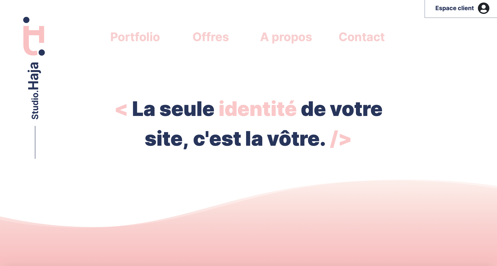
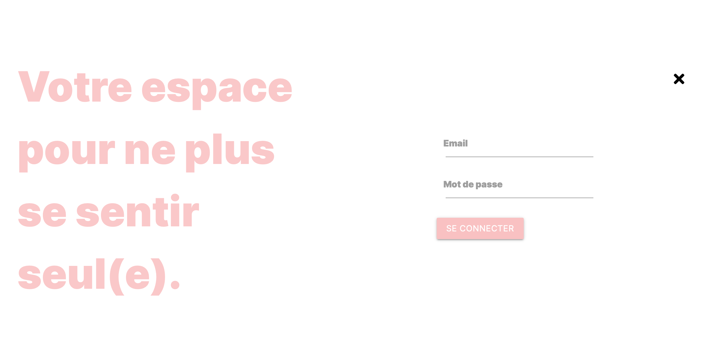
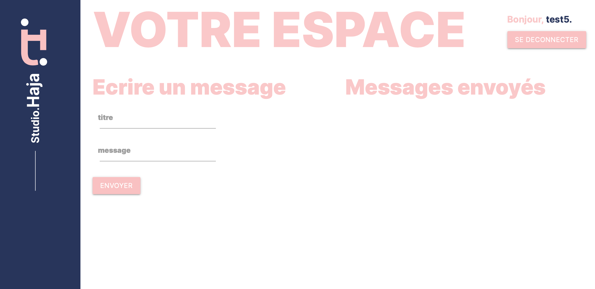
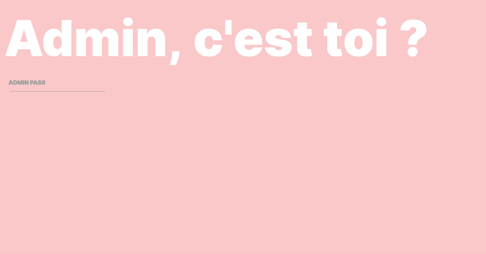

Pour construire ce site, j'ai profité du confinement pour m'initier à la MERN Stack avec **MongoDB Atlas** pour la base de donnée (NoSQL), **Node.js** et **Express.js** pour créer l'API REST et **React.js** coté front.

##### Packages utilisés : 

>- **FRONT** :
>    - axios
>    - react-materialize
>    - node-sass
>    - react-external-link
>    - react-reveal
>
>- **BACK** : 
>    - bcrypt
>    - body-parser
>    - concurrently
>    - cors
>    - express
>    - express-mongo-sanitize
>    - express-rate-limit
>    - helmet
>    - jsonwebtoken
>    - mailgun-js
>    - mongoose
>    - mongoose-unique-validator
>    - multer
>    - nodemailer
>    - nodemailer-mailgun-transport
>    - nodemon
>    - xss-clean

La partie Front faite en React se présente sous forme d'onglets qui défilent. Le front est déjà chargé au démarrage, ce qui permet une plus grande rapidité lors de la navigation.

Le site possède un espace où le client se connecte avec ses identifiants préalablement donnés lors de la prise de contact.

Grâce à l'espace Admin du site, je peux enregistrer un nouveau client en base de donnée et répondre à ses billets.

J'ai utilisé HEROKU pour heberger le projet car c'est un système très simple d'utilisation et rapide.

Le site se visite ici ([Lien projet de fin d'étude](https://studiohajafinal.herokuapp.com)).